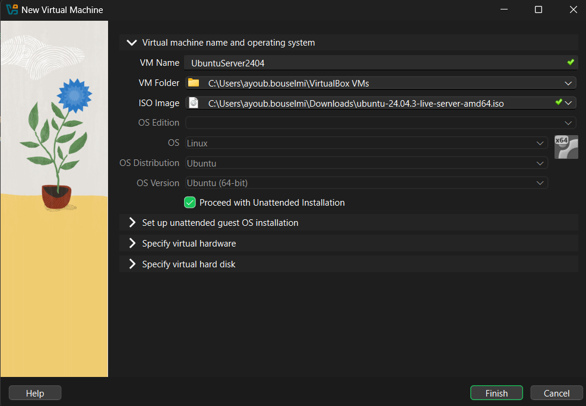
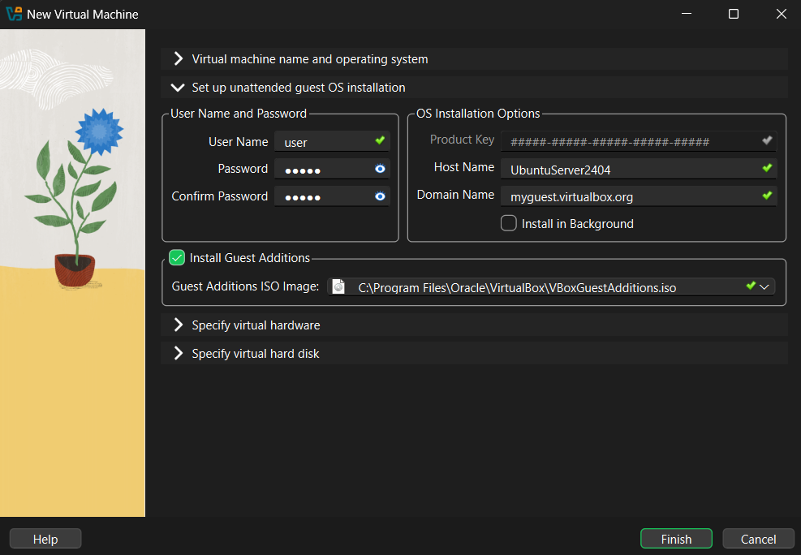
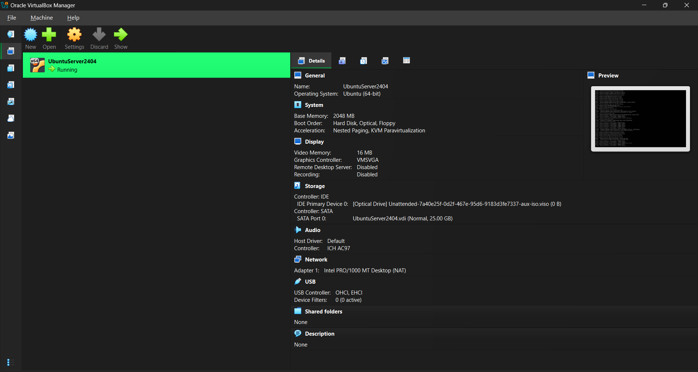
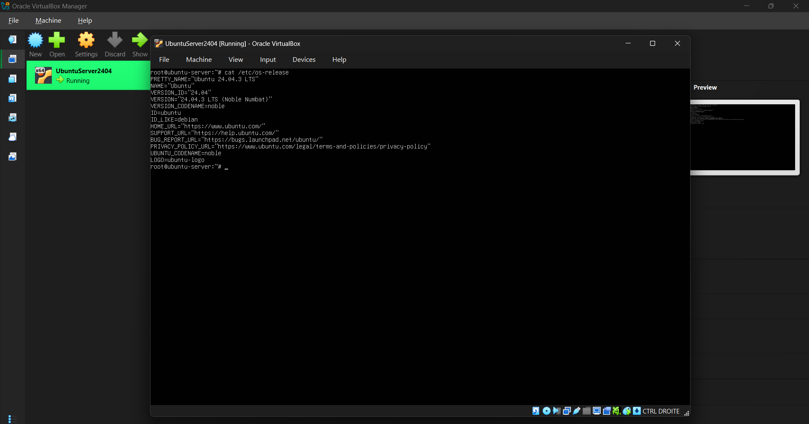

# VirtualBox Setup

## 1. Install VirtualBox

Go to https://www.virtualbox.org/wiki/Downloads and download the latest software
release of VirtualBox.

Install it by following the installation instructions.

  > **Tutorial Video**: https://www.youtube.com/watch?v=G1C5SRqkwy8

## 2. Download a Linux image

  > **Note** In the following, I'll be using Ubuntu Server, but feel free to use your favorite linux distribution.

To download Ubuntu Server, go to: https://ubuntu.com/download/server and download the `24.04.x LTS`.

## 3. Create a VM

Once the download is finished, open up VirtualBox and create your VM.

   1. Click `New`
   2. Use the following screenshots to help you configure the first 2 steps and leave the rest as is.  
   3. Click `Finish`
   4. The final configuration should look like this: 
   5. Once the VM is booted, you can verify your OS release version: 
