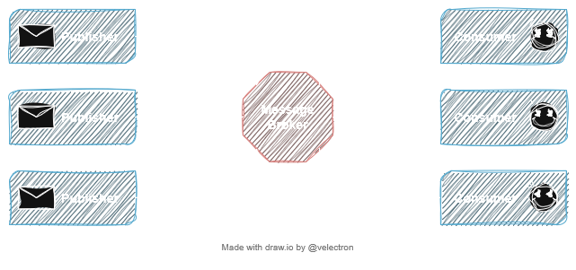

# DS 3: Publish/Subscribe design patterns

  - Related course module: Distributed Systems
  - Tutorial scope: DS Design and Implementation
  - Technologies: Linux, Docker, RabbitMQ

During this tutorial, we will learn few things like:

  - How to install and configure a communication broker
  - How to develop an event-based application
  - Deploy the service using docker compose

> <strong>Note:</strong> In the following, you will see `Discover` if you should play around
> and see the documentation or test. You will see `Action` if you should
> run a command, write a program, or something similar. You will see `Question` when there is a question to provide an answer to.

## 1. Prerequisites

  1. A functional linux environment
  2. A function Docker installation
  3. Github or Gitlab account

Check out these tutorials on how to get a Linux OS up and running:

  - [VirtualBox](../VirtualBox.md)
  - [WSL](../WSL.md)

Check out [Lab0: Foundations 1 - Deployment of a Centralized App](../lab0/) to learn more about installing docker and docker compose.

## 2. Before you start 🚨

I recommend that you create a text file with your favorite editor where you will continuously copy the commands and
their output to help you with your Lab report.

> <strong>Note:</strong> Your report should include a <strong>link to your project's git repo</strong>

## 3. RabbitMQ deployment

`Discover`

Explore the following documentation:

 - https://www.rabbitmq.com/docs/download
 - https://hub.docker.com/_/rabbitmq

`Action`

 1. Create a docker compose file using `rabbitmq:management-alpine` to deploy a RabbitMQ service
 1. Include the docker-compose.yml content in your report
 1. Include the service startup logs in your report
 1. Connect to RabbitMQ management dashboard and explore it

> <strong>Note:</strong> For the rest of this Lab we will use exclusivly Pika Python Clients

## 4. Publish/Subscribe design patterns

### 4.0. Hello world

This section uses code from this [documentation](https://www.rabbitmq.com/tutorials/tutorial-one-python).

`Question`
  - What is a queue?
  - What is the role of the send module?
  - What is the role of the receive module?

`Action`

 1. Execute `send` and `receive` modules
 1. Modify the `send` code to send an new message each second (no time limit)

### 4.1. Publish/Subscribe

This section uses code from this [documentation](https://www.rabbitmq.com/tutorials/tutorial-three-python)

`Question`
  - What is an exchange?
  - How many exchange types and which one is used?
  - What is a binding?
  - What is the role of the emit_log module?
  - What is the role of the receive_log module?

`Action`
 1. Execute `receive_log` and `emit_log` modules
 1. Explore the management dashboard to visualize the created resources
 1. Provide the list of created bindings

### 4.2. Topics

This section uses code from this [documentation](https://www.rabbitmq.com/tutorials/tutorial-five-python)

`Question`
  - What are the properties of a routing key?
  - What are the available wildcards in RabbitMQ?

`Action`
 1. Execute `receive_logs_topic` module using a binding key of your choice
 1. Execute `emit_log_topic` module using different binding keys including the previously selected one. Notice the behaviour of the application.
 1. Explore the management dashboard to visualize the created resources
 1. Provide the list of created bindings

### 4.3. Read the docs

 - Which concept should be used to deliver a task to exactly one worker ?
 - Which concept should be used to deliver a message to multiple consumers?
 - What is the difference between fanout and direct exchanges?
 - Inability to route messages based on multiple criteria is a limitation of which exchange type?
 - What is the solution to this limitation?

The END.
